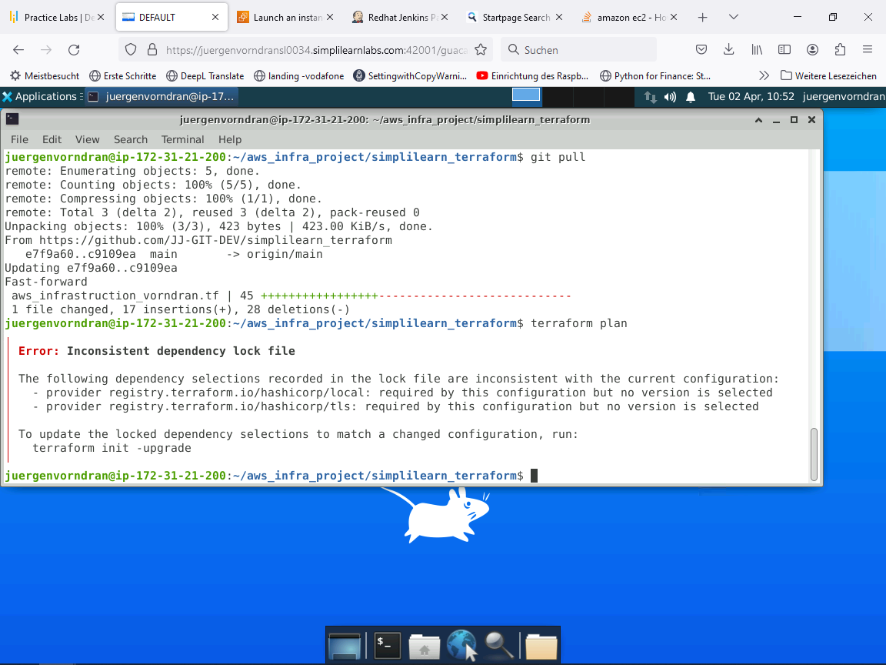

### Project: Automating Infrastructure using Terraform - simplilearn
====================

This description shows how you can use terraforms to create an infrastructure on aws. When creating the infrastructure, various automation tools (jenkins, java, python) are installed on the instance.

## 1. configuration an service on AWS
 1.1 IAM - create user for the connection


 1.2 Permissions for user


 1.3 Create access key for user


 1.4 Access key for using with command line interface (CLI)


 1.5 Store the Access key and Secret access key on the local machine
 ```terminal
    aws configure
 ```
 aws configure will be store in .aws on profile


 1.6 Resource ID for ubuntu machine on EC2


## 2 Resource for the infrastructure as a code
 2.1 Disconnecting from the configuration and variable creates the variable.tf file and saves the variable

 2.2 configuration vpc on the resource block aws_vpc with subnet and route table

 2.3 next configuration resource block create securty group to allow tls inbound traffic

 2.4 afterwards in the configuration will create the resource for private and public key for the connect. for the resource we need to install a plugin:
```terminal
    terraform init -upgrade
```



 2.5 provisioner "remote-exec" resource block is for the installation of java, jenkins and python in the instance

 2.6 terraform commands to use
terraform plan -> verify the command 
terrafrom apply -> execute and create
terraform destroy -> delete the infrastructure

 2.7 output\result of the installation in aws
aws create instance WebServer


 2.8 output terraform plan
```terminal
root@ip-172-31-21-200:/home/juergenvorndran/aws_infra_project/simplilearn_terraform# terraform plan -out plan_output.txt
tls_private_key.web-key: Refreshing state... [id=1d703f240a481287aedd8f3f73404eeb89afca01]
local_file.web-key: Refreshing state... [id=6fe084af556e95de3515ce42b424e338cc2a64ac]
aws_key_pair.app-web-key: Refreshing state... [id=web-key]
aws_vpc.sl-vpc: Refreshing state... [id=vpc-0ba589545132e3381]
data.aws_ami.ami_dynamic: Reading...
data.aws_ami.ami_dynamic: Read complete after 0s [id=ami-0bd01824d64912730]
aws_route_table.sl-route-table: Refreshing state... [id=rtb-0d55727f2933a78d2]
aws_internet_gateway.sl-gw: Refreshing state... [id=igw-0423b121b4ebcf33c]
aws_subnet.subnet-1: Refreshing state... [id=subnet-0e34d5ed5ecfcf2f2]
aws_security_group.allow_web: Refreshing state... [id=sg-0f22bdb273754fe12]
aws_route.sl-route: Refreshing state... [id=r-rtb-0d55727f2933a78d21080289494]
aws_route_table_association.a: Refreshing state... [id=rtbassoc-06ac4865602427b56]
aws_instance.ec2_web_pipeline: Refreshing state... [id=i-01a24e316ae5b2fb5]

Terraform used the selected providers to generate the following execution plan. Resource actions are indicated with
the following symbols:
-/+ destroy and then create replacement

Terraform will perform the following actions:

  # aws_instance.ec2_web_pipeline is tainted, so must be replaced
-/+ resource "aws_instance" "ec2_web_pipeline" {
      ~ arn                                  = "arn:aws:ec2:us-east-1:825758607338:instance/i-01a24e316ae5b2fb5" -> (known after apply)
      ~ associate_public_ip_address          = true -> (known after apply)
      ~ availability_zone                    = "us-east-1b" -> (known after apply)
      ~ cpu_core_count                       = 1 -> (known after apply)
      ~ cpu_threads_per_core                 = 1 -> (known after apply)
      ~ disable_api_stop                     = false -> (known after apply)
      ~ disable_api_termination              = false -> (known after apply)
      ~ ebs_optimized                        = false -> (known after apply)
      - hibernation                          = false -> null
      + host_id                              = (known after apply)
      + host_resource_group_arn              = (known after apply)
      + iam_instance_profile                 = (known after apply)
      ~ id                                   = "i-01a24e316ae5b2fb5" -> (known after apply)
      ~ instance_initiated_shutdown_behavior = "stop" -> (known after apply)
      + instance_lifecycle                   = (known after apply)
      ~ instance_state                       = "running" -> (known after apply)
      ~ ipv6_address_count                   = 0 -> (known after apply)
      ~ ipv6_addresses                       = [] -> (known after apply)
      ~ monitoring                           = false -> (known after apply)
      + outpost_arn                          = (known after apply)
      + password_data                        = (known after apply)
      + placement_group                      = (known after apply)
      ~ placement_partition_number           = 0 -> (known after apply)
      ~ primary_network_interface_id         = "eni-025b0ce97d6f319b2" -> (known after apply)
      ~ private_dns                          = "ip-10-0-1-220.ec2.internal" -> (known after apply)
      ~ private_ip                           = "10.0.1.220" -> (known after apply)
      + public_dns                           = (known after apply)
      ~ public_ip                            = "44.204.204.27" -> (known after apply)
      ~ secondary_private_ips                = [] -> (known after apply)
      ~ security_groups                      = [
          + "sg-0f22bdb273754fe12",
        ]
      + spot_instance_request_id             = (known after apply)
        tags                                 = {
            "Name" = "WebServer"
        }
      ~ tenancy                              = "default" -> (known after apply)
      + user_data                            = (known after apply)
      + user_data_base64                     = (known after apply)
      ~ vpc_security_group_ids               = [
          - "sg-0f22bdb273754fe12",
        ] -> (known after apply)
        # (8 unchanged attributes hidden)

      - capacity_reservation_specification {
          - capacity_reservation_preference = "open" -> null
        }

      - cpu_options {
          - core_count       = 1 -> null
          - threads_per_core = 1 -> null
        }

      - credit_specification {
          - cpu_credits = "standard" -> null
        }

      - enclave_options {
          - enabled = false -> null
        }

      - maintenance_options {
          - auto_recovery = "default" -> null
        }

      - metadata_options {
          - http_endpoint               = "enabled" -> null
          - http_protocol_ipv6          = "disabled" -> null
          - http_put_response_hop_limit = 1 -> null
          - http_tokens                 = "optional" -> null
          - instance_metadata_tags      = "disabled" -> null
        }

      - private_dns_name_options {
          - enable_resource_name_dns_a_record    = false -> null
          - enable_resource_name_dns_aaaa_record = false -> null
          - hostname_type                        = "ip-name" -> null
        }

      - root_block_device {
          - delete_on_termination = true -> null
          - device_name           = "/dev/sda1" -> null
          - encrypted             = false -> null
          - iops                  = 100 -> null
          - tags                  = {} -> null
          - tags_all              = {} -> null
          - throughput            = 0 -> null
          - volume_id             = "vol-008a655315a0dc317" -> null
          - volume_size           = 8 -> null
          - volume_type           = "gp2" -> null
        }
    }

Plan: 1 to add, 0 to change, 1 to destroy.

─────────────────────────────────────────────────────────────────────────────────────────────────────────────────────

Saved the plan to: plan_output.txt

To perform exactly these actions, run the following command to apply:
    terraform apply "plan_output.txt"

```